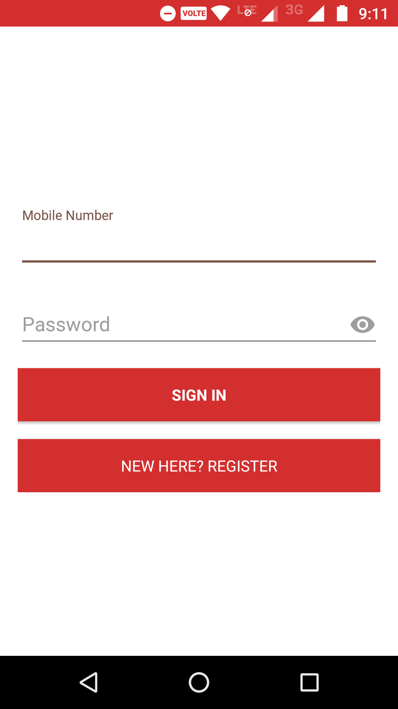
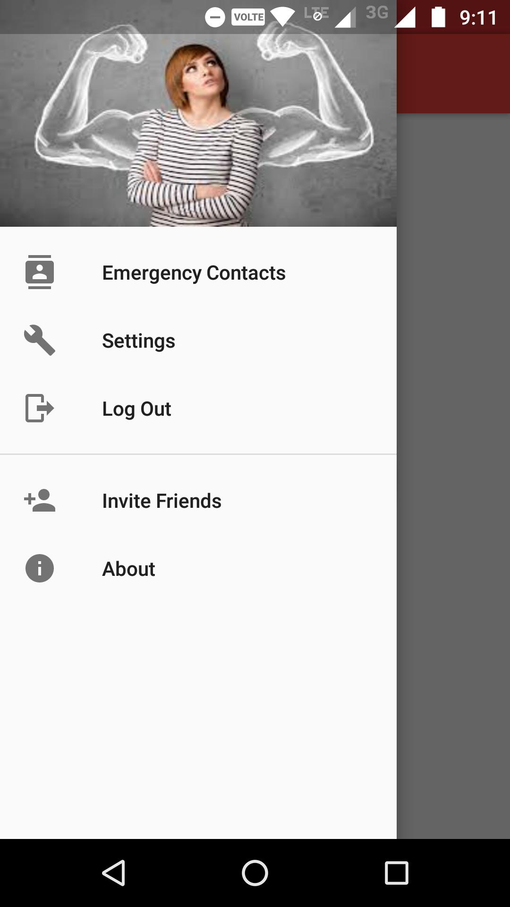
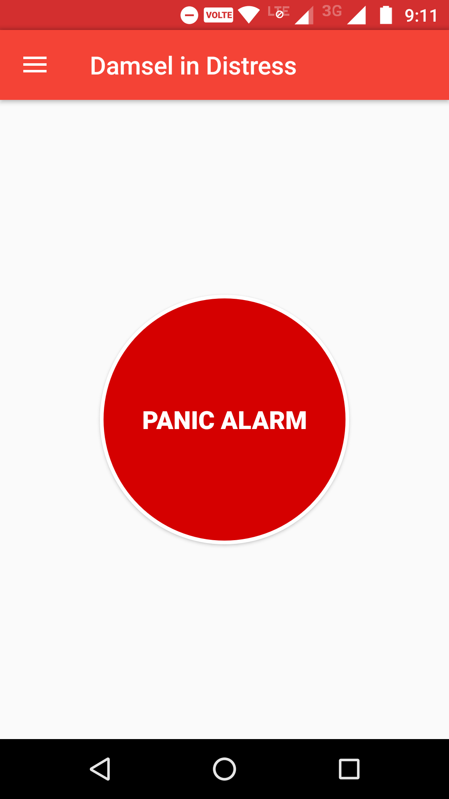
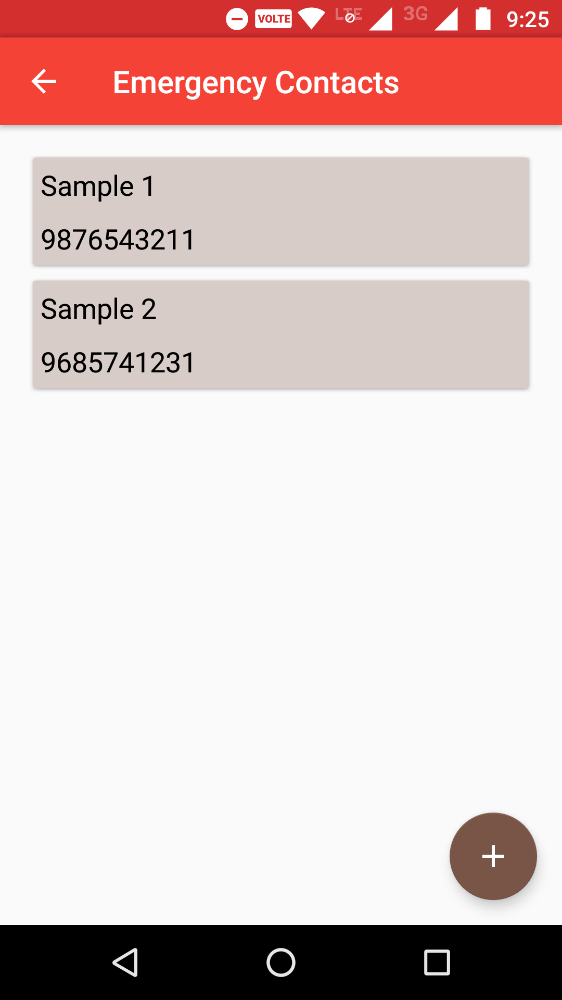

# Damsel-In-Distress
An android app that focuses on women safety. It plays high frequency scream when the phone is shaken strongly thrice and simultaneously sends text alert to people nearby her current location who have the application installed with her location coordinates.

## Download
Download app from [here](https://github.com/DevipriyaSarkar/Damsel-In-Distress/releases).

## Screenshots

## Setup
1. Clone/download the repository.
2. Put your `TWILIO API KEY` in this [file](app/src/main/java/com/teapink/damselindistress/AppController.java). The key can be obtained from [here](https://www.twilio.com/).
3. Set up Firebase Realtime Database for Android by following the instructions [here](https://firebase.google.com/docs/database/android/start/).  
	At the end, you'll download a `google-services.json` file which should be moved to [`app/`](app/).
4. To build this project, use the "gradlew build" command or use "Import Project" in Android Studio.

## License
The content of this repository is licensed under [MIT LICENSE](LICENSE).
